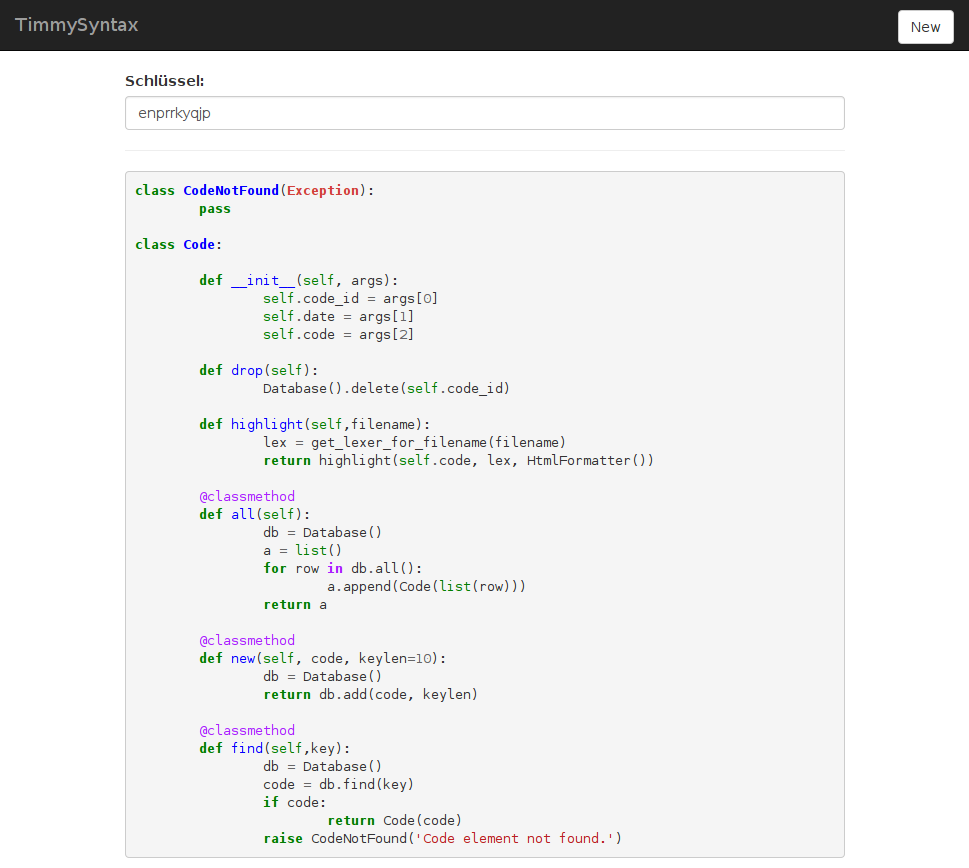

timmyPaste
===========

It representes only a poor pastbin clone.
Written in Python(3)-Flask with an SQLite backend.



Features
--------

* Simple deployment.
* Lightweight.
* Realtime syntax highlighting based on language suffix.
* Private and public posts.

**Coming soon**

* *Full restfull api implementation*
* *Image upload*
* *URL truncation*
* *Expire of pastes*

Requirements
------------

* sqlite3
* pygments
* flask
* flask-restful
* flask-classy
* flask-babel
* hamlish_jinja
* (*gunicorn*)

**Note**

Before you are able to use it, you need to create the Database.
You only need to open a python shell an type the following:

```python
  import lib.db
  lib.db.Database().create()
```

You also need to compile the locales. This would do this for you.
If it failes, please take a look at: https://github.com/mitsuhiko/flask-babel/issues/43

```bash
  pybabel compile -d translations
```

API Reference
-------------

### GET: /pa/
```
  Returns all public pastes.
```

### GET: /pa/..key..
```
  Return the paste if it could be found.
```

Sample:

```json
  {
    "code": "moo",
    "date": "2015-01-07 23:42:31.275959",
    "is_private": true,
    "key": "xbvfwwaxxfxwqetxvmqjaoqyaxtlaalxlmwhegvpnearcjqcgr"
  }
```

If key couldn't be found.

```json
  {
    "requested_key": "ecctxqecjra",
    "status": 404,
    "message": "Cound not found such key."
  }
```
### POST: /pa/
```
  Requested JSON fromatted data.
  Please check that your 'Content-Type' is set to 'application/json'.

  Returns the paste created paste.
```

Sample:

```json
  {
    "data": "moo",
    "is_private": true
  }
```

Result: 

```json
  {
    "code": "moo",
    "date": "2015-01-07 23:42:31.275959",
    "is_private": true,
    "key": "xbvfwwaxxfxwqetxvmqjaoqyaxtlaalxlmwhegvpnearcjqcgr"
  }
```

Setup
----------

You could start them with gunicorn.
There is also an systemd service / socket file shipped.
You only need to replace your WorkingDir and username. 
It will start an GUnicorn on local:9000 or ::8000.

If your using FreeBSD, there is also an rc.d script stored 
in the 'system' folder. Please check it out.

For your firstly checking this app, your could start as it is discribed
in the following section.

```bash
gunicorn app:app -w 1 -b 0.0.0.0:5000
```

or easier for development.

```bash
python app.py
```


